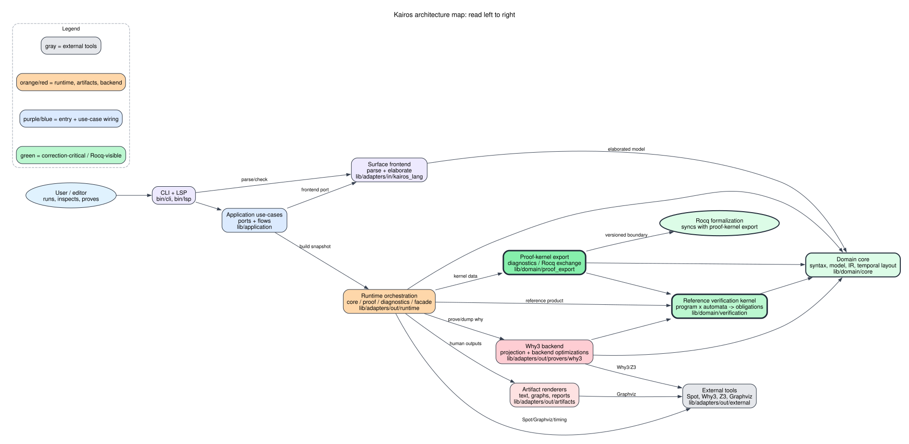
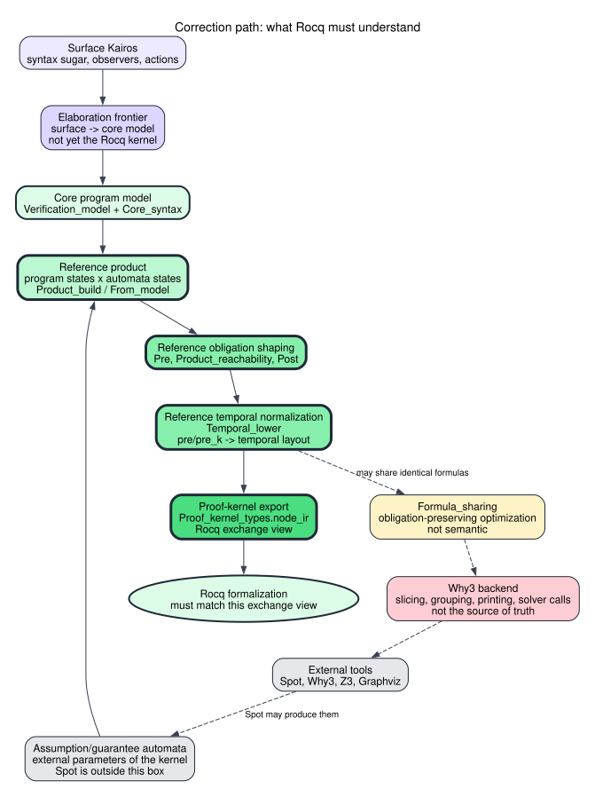
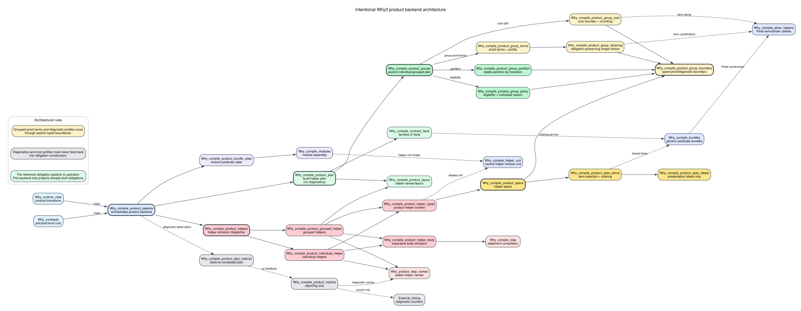

# Lire l'architecture de Kairos

Cette page est le point d'entree humain. Les diagrammes C4 et les graphes
`odep` sont utiles, mais ils ne doivent pas etre lus en premier.

## Ce Qu'il Faut Lire En Premier

Commencer par l'atlas des modules si tu cherches quel fichier ouvrir :

- `module_atlas.md`
- `../rocq_alignment_manifest.json` pour savoir quelle unite Kairos doit
  matcher quelle couche Rocq.
- `../rocq_projection_audit.json` pour le detail champ par champ
  `ProofStepSummary` / `SummaryClauseFamilies` / `StepContract`.

Puis regarder cette carte simplifiee :



Elle se lit de gauche a droite.

Le code important pour la correction est en vert :

- `lib/domain/core`
- `lib/domain/verification`

`lib/domain/proof_export` est une projection d'echange utile pour les
diagnostics et une synchronisation Rocq future, mais ce n'est pas le noyau
essentiel a prouver.

Le reste est necessaire pour faire tourner l'outil, mais ne doit pas definir
la semantique de verification :

- entrees utilisateur : CLI, LSP, frontend ;
- orchestration : snapshots, dumps, proof runs ;
- backends : Why3, Z3, Graphviz, text/rendering ;
- optimisations : sharing, slicing, grouping, batching.

## Chemin De Correction

La vue suivante montre seulement le noyau essentiel a comparer avec Rocq. La
granularite exacte est dans `../rocq_alignment_manifest.json`.



Le chemin de reference est :

```text
Core program model
  + supplied automata
  + validation de forme normale des automates
  -> reference product
  -> product summaries and clause families
  -> step contracts / lowering
  -> obligations essentielles
  -> vues derivees pour export/diagnostic si necessaire
```

La regle de lecture est simple :

```text
Si une transformation change ce chemin, elle concerne la correction.
Si elle change seulement Why3, les dumps, le scheduling ou le rendu,
elle ne doit pas changer la sortie kernel.
```

## Table Des Blocs

| Bloc | Chemins | Role | Rocq |
| --- | --- | --- | --- |
| CLI / LSP | paquets `kairos-cli`, `kairos-lsp` | Entrees utilisateur via `kairos.engine` | Non |
| Frontend | `lib/adapters/in/kairos_lang` | Parse et elabore le langage de surface | Pas encore, sauf theoreme d'elaboration futur |
| Application | `lib/application` | Ports et use-cases | Non |
| Domain core | `lib/domain/core` | Syntaxe, modeles, IR, temporal layout | Oui |
| Verification kernel | `lib/domain/verification` | Valide la forme des automates, produit programme x automates, obligations de reference | Oui, avec classification par passe |
| Obligations canoniques | `lib/domain/verification/canonical_obligations.*` | Familles Stage 1 / Stage 2 a comparer avec Rocq, avant export et backend | Reference |
| Rocq alignment views | `lib/domain/verification/product_summary_projection.*`, `lib/domain/verification/kernel_clause_projection.*`, `lib/domain/verification/obligation_family_projection.*`, `lib/domain/verification/step_contract_projection.*` | Vues derivees product-summary, KernelClause, familles d'obligations et step-contract consommees par proof_export et Why3 | Projection |
| Proof export | `lib/domain/proof_export` | Vue d'echange proof-kernel pour diagnostics et Rocq futur | Projection, peut servir de temoin des vues product-summary / step-contract |
| Runtime | `lib/adapters/out/runtime` | Snapshots, dumps, orchestration, proof runs | Non |
| Why3 backend | `lib/adapters/out/provers/why3` | Projection Why3 et choix backend | Non |
| Artifacts | `lib/adapters/out/artifacts` | Rendus texte/graphe/diagnostic | Non |
| External tools | `lib/adapters/out/external` | Spot, Why3, Z3, Graphviz, timing | Non |

## Classification Des Passes

| Passe | Classification | Pourquoi |
| --- | --- | --- |
| `Pre` | Reference | Ajoute les hypotheses necessaires aux pas produit |
| `Product_reachability` | Reference extension | Ajoute des obligations d'inatteignabilite/preservation, ne doit pas etre vu comme pruning |
| `Post` | Reference | Ajoute les obligations de sortie et de progression |
| `Temporal_lower` | Reference normalization | Rend explicites `pre/pre_k` via le layout temporel |
| `Formula_sharing` | Obligation-preserving optimization | Ne doit que partager physiquement des formules egales |

## Alignement Rocq

La formalisation Rocq courante prise comme source est :

```text
/Users/fdabrowski/Repos/kairos/kairos-spec/kairos-rocq
branch lab/rocq-paper-core
commit f3facc051901245e33a4d79676fcff6fcd464087
```

Le theoreme de coeur a aligner est :

```text
GeneratedObligationsValid
  -> contract_valid
```

Pour le papier, on part de ces coupures Rocq :

- programmes bien formes ;
- runs instrumentes et observations ;
- automates de contrat ;
- ancres produit et summaries ;
- projection product-summary : `ProofStepSummary` /
  `SummaryClauseFamilies` (coupe Rocq Stage 1) ;
- obligations canoniques : clauses Stage 1 et `StepContract` Stage 2 ;
- vue step-contract : contrats groupes derives pour le backend ;
- validite des obligations generees ;
- soundness globale.

Le fichier `../rocq_alignment_manifest.json` donne la table precise
Rocq -> Kairos pour chacune de ces coupures.

Le fichier `../rocq_projection_audit.json` donne la conclusion d'architecture :
il faut introduire des projections explicites product-summary et
step-contract, parce que les champs Rocq sont actuellement eparpilles entre
`Ir.product_step_summary`, `Proof_kernel_types.proof_step_summary_ir`,
`Why_runtime_view` et les contrats Why3.

La version machine-lisible de cette table est :

- `docs/reference_pipeline_boundaries.json`

Le check associe est :

```sh
python3 scripts/check_reference_pipeline_boundaries.py
```

## Frontiere Locale Du Backend Why3

Le backend Why3 a sa propre separation interne. Elle ne fait pas partie de la
frontiere Rocq, mais elle doit rester claire pour ne pas transformer une
optimisation de representation en changement d'obligations.



- `why_compile_product_group_boundary` definit les types frontieres :
  `proof_terms` pour l'emission, `profile` pour le diagnostic.
- `why_compile_product_group_partition` regroupe les pas par transition
  executable sans connaitre la politique de groupage.
- `why_compile_product_group_policy` decide si un groupe est eligible et donne
  la raison explicite d'un helper individuel.
- `why_compile_product_group_terms` est une projection backend. Il transforme
  les obligations deja choisies en termes Why3, sans politique de cout.
- `why_compile_product_group_factoring` est une optimisation preservant les
  obligations. Il choisit entre des formes logiquement equivalentes de la meme
  spec groupee.
- `why_compile_product_group_cost` est une heuristique backend. Il decoupe les
  groupes selon un cout estime, sans supprimer d'obligation.
- `why_compile_product_metrics` est du diagnostic. Il enregistre les choix et
  couts, ainsi que les raisons d'individualisation ; il ne doit jamais
  influencer la generation.

La metrique de factorisation sert a comprendre le backend. Elle ne doit pas
etre lue par le noyau de reference, ni par Rocq, ni par une passe qui change le
contenu canonique des obligations.

## Comment Utiliser Les Graphes Detaillees

Les vues automatiques sont dans `observed/`.

- `observed/dune-libraries.svg` : utile pour voir les dependances entre
  bibliotheques Dune.
- `observed/dune-modules.svg` : utile pour enqueter localement, mais trop
  dense comme vue de depart.
- `observed/why3-product-backend.svg` : vue filtree des dependances observees
  du backend Why3 produit, a utiliser avant le graphe complet quand on travaille
  sur le plan et l'emission des helpers produit.

Comparer cette vue observee avec `manual/why3-product-backend-intent.svg` :
la premiere dit ce que Dune voit, la seconde dit quelle separation on veut
maintenir. La synthese des ecarts est dans
`why3_product_backend_alignment.md`.

Les vues C4 Structurizr sont dans `structurizr/export/`.

- `structurizr-kairos-system-context.svg` : qui parle a Kairos.
- `structurizr-kairos-containers.svg` : decomposition intentionnelle.

Ces graphes servent a verifier une hypothese. Ils ne remplacent pas la carte
simplifiee ci-dessus.

## Questions A Poser Avant De Modifier Le Code

1. Est-ce que je change le chemin de correction ?
2. Est-ce que Rocq doit voir cette transformation ?
3. Est-ce une normalisation semantique ou une optimisation ?
4. Est-ce que cette optimisation peut changer la sortie proof-kernel ?
5. Est-ce que l'information appartient au programme, au produit, aux
   obligations, au backend, ou au reporting ?
6. Est-ce que le changement depend d'un outil externe ?

Si la reponse a 1 ou 2 est oui, le changement doit passer par le manifeste de
frontiere et les tests de stabilite kernel.
