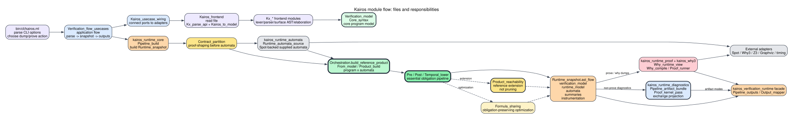

# Atlas Des Modules Kairos

Cette page repond a la question pratique : "qui fait quoi, et dans quel
fichier ?"

Le graphe le plus utile est celui-ci :



Il ne montre pas toutes les dependances. Il montre le chemin que suit une
commande Kairos normale.

## Lecture Rapide

```text
bin/cli/kairos.ml
  -> Verification_flow_usecases
  -> Kairos_usecase_wiring
  -> Kairos_frontend
  -> kairos_runtime_core / Pipeline_build
  -> kairos_runtime_automata / Runtime_automata_source
  -> Orchestration / From_model / passes
  -> kairos_verification_runtime / Pipeline_outputs
  -> kairos_runtime_proof ou kairos_runtime_diagnostics
```

La separation essentielle est :

```text
Correction:
  lib/domain/core
  lib/domain/verification
  lib/domain/proof_export

Execution de l'outil:
  lib/application
  lib/composition
  lib/adapters/*
  bin/*
```

## Parcours D'une Commande `--prove`

| Etape | Module / fichier | Fonction cle | Role |
| --- | --- | --- | --- |
| 1 | `bin/cli/kairos.ml` | `exec_action` | Decode les options CLI et choisit l'action |
| 2 | `lib/application/verification_flow_usecases.ml` | `run` | Orchestre le use-case application |
| 3 | `lib/composition/kairos_usecase_wiring.ml` | `Ports` | Branche les ports abstraits sur les adaptateurs concrets |
| 4 | `lib/adapters/in/kairos_lang/kairos_frontend.ml` | `parse_input` | Lit le fichier, parse, elabore, produit `Verification_model` |
| 5 | `lib/adapters/out/runtime/orchestration/core/pipeline_build.ml` | `prepare_program_from_frontend` | Prepare le programme runtime |
| 6 | `lib/adapters/out/runtime/orchestration/core/contract_partition.ml` | `partition_program` | Regroupe ou preserve les contrats publics selon les options |
| 7 | `lib/adapters/out/runtime/orchestration/automata/runtime_automata_source.ml` | `produce_with_spot` | Produit un paquet d'automates fourni au core runtime |
| 8 | `lib/adapters/out/runtime/orchestration/automata/automata_generation.ml` | `run` | Transforme assumptions/guarantees en automates via un builder injecte |
| 9 | `lib/adapters/out/external/spot/spot_automaton_builder.ml` | `build` | Appelle Spot pour construire les automates |
| 10 | `lib/domain/verification/orchestration.ml` | `build_reference_product` | Point nomme du produit de reference |
| 11 | `lib/domain/verification/from_model.ml` | `of_model_program` | Produit les summaries depuis programme + automates |
| 12 | `lib/domain/verification/orchestration.ml` | `build_instrumented_ir` | Lance `Pre`, `Product_reachability`, `Post`, `Temporal_lower`, `Formula_sharing` |
| 13 | `lib/adapters/out/runtime/orchestration/core/runtime_snapshot.ml` | `pipeline_snapshot` | Contient les ASTs/modeles/IR utilises ensuite |
| 14 | `lib/adapters/out/runtime/orchestration/outputs/pipeline_outputs.ml` | `build_outputs` | En mode `--prove`, evite les dumps lourds et lance le proof runner |
| 15 | `lib/adapters/out/runtime/orchestration/outputs/proof_runner.ml` | `run` | Prepare et lance les obligations Why3/Z3 |
| 16 | `lib/adapters/out/provers/why3/*` | `Why_compile`, `Why_pipeline` | Projection Why3 et generation de taches |
| 17 | `lib/adapters/out/external/why3/*` | `Why_contract_prove` | Interaction avec Why3/provers |

Point important : en mode `--prove` minimal, `Pipeline_outputs.is_prove_only_run`
fait que `Pipeline_artifact_bundle.build` n'est pas appele. Donc les graphes
et gros dumps ne sont pas produits.

## Parcours D'un Dump De Diagnostic

| Etape | Module / fichier | Fonction cle | Role |
| --- | --- | --- | --- |
| 1 | `bin/cli/kairos.ml` | `exec_dump_mode` | Choisit le dump demande |
| 2 | `lib/application/verification_flow_usecases.ml` | use-case de dump | Orchestre le pipeline sans lancer `--prove` |
| 3 | `lib/adapters/out/runtime/orchestration/outputs/pipeline_artifact_bundle.ml` | `build` | Construit graphes, textes et donnees proof-kernel |
| 4 | `lib/domain/proof_export/proof_kernel_pass.ml` | `compile_node` | Produit `Proof_kernel_types.node_ir` |
| 5 | `lib/adapters/out/runtime/orchestration/outputs/output_mapper.ml` | mapping de sortie | Assemble les sorties utilisateur |

Ce chemin est fait pour inspection. Il n'est pas lance par defaut dans
`--prove`.

## Donnees Principales

| Donnee | Type / module | Cree par | Consomme par |
| --- | --- | --- | --- |
| Surface AST | `Kx_surface_syntax` | Parser/frontend | `Kx_elaborate` |
| Elaborated AST | `Kx_ast` | `Kx_parse_api` / `Kx_elaborate` | `Kairos_to_model` |
| Core program model | `Verification_model.program_model` | `Kairos_to_model` | `Pipeline_build`, runtime automata source, `From_model` |
| Runtime model | `Verification_model.program_model` | `Contract_partition` | Automata/product |
| Automata | `Automaton_types.automata_spec` | `kairos_runtime_automata` + Spot adapter | `From_model`, graph renderers |
| Product summaries | `Ir.node_ir list` | `From_model.of_model_program` | `Pre/Post/...`, renderers |
| Instrumented IR | `Ir.program_ir` | `Orchestration.build_instrumented_ir` | Why3 backend, proof export |
| Runtime snapshot | `Runtime_snapshot.pipeline_snapshot` | `Pipeline_build` in `kairos_runtime_core` | facade outputs, proof runner, diagnostics |
| Kernel IR | `Proof_kernel_types.node_ir` | `Proof_kernel_pass` | diagnostics, Rocq sync futur, cost report |
| Why3 AST/text | backend-specific | `Why_compile` | Why3/external prover |

## Modules Par Responsabilite

### Frontend

| Module | Responsabilite |
| --- | --- |
| `kx_lexer.ml`, `kx_parser.mly` | Lexer/parser du langage Kairos |
| `kx_surface_syntax.ml` | AST de surface, avec sucre syntaxique |
| `kx_ast.ml` | AST elabore plus proche du core |
| `kx_elaborate.ml` | Orchestration de l'elaboration vers l'AST elabore |
| `kx_elaborate_names.ml` | Conventions de nommage pour indices et historiques generes |
| `kx_elaborate_subst.ml` | Substitution capture-avoiding sur la syntaxe de surface |
| `kx_elaborate_observers.ml` | Generation des declarations et updates proof-only des observers |
| `kx_elaborate_state_selectors.ml` | Expansion des selecteurs d'etats pour invariants de surface |
| `kx_elaborate_validation.ml` | Validations de surface avant abaissement vers l'AST elabore |
| `kx_parse_api.ml` | API de parsing utilisee par CLI/LSP/tests |
| `kairos_to_model.ml` | Conversion vers `Verification_model` |
| `kairos_frontend.ml` | Adaptateur frontend complet : fichier -> `Application_ports.frontend_input` |

### Application Et Wiring

| Module | Responsabilite |
| --- | --- |
| `application_ports.ml/mli` | Interfaces abstraites entre use-cases et adaptateurs |
| `pipeline_types.ml/mli` | Types de configuration, options, sorties et erreurs |
| `verification_flow_usecases.ml` | Use-cases : `run`, `why_pass`, `obligations_pass`, dumps |
| `kairos_usecase_wiring.ml` | Composition root : branche les ports sur les modules concrets |

### Noyau De Correction

| Module | Responsabilite |
| --- | --- |
| `core_syntax.ml` | Expressions, formules, statements, types de base |
| `verification_model.ml` | Modele core du programme Kairos |
| `ir.ml/mli` | IR de summaries produit x automates |
| `pre_k_layout.ml`, `pre_k_lowering.ml` | Representation explicite de l'historique temporel |
| `product_build.ml` | Exploration du produit programme x automates |
| `from_model.ml` | Conversion modele + automates -> summaries |
| `pre.ml` | Ajoute les hypotheses de pas |
| `product_reachability.ml` | Ajoute les obligations liees aux destinations inatteignables |
| `post.ml` | Ajoute les obligations de sortie/progression |
| `temporal_lower.ml` | Abaisse `pre/pre_k` vers le layout temporel |
| `formula_sharing.ml` | Optimisation de representation, pas semantique |
| `orchestration.ml` | Ordre des passes et point `build_reference_product` |

### Export Proof-Kernel / Rocq Futur

| Module | Responsabilite |
| --- | --- |
| `proof_kernel_types.ml/mli` | Format d'echange proof-kernel |
| `proof_kernel_product.ml` | Produit explicite exporte |
| `proof_kernel_generated_clauses.ml` | Clauses generees avant lowering relationnel |
| `proof_kernel_clause_lowering.ml` | Clauses relationnelles |
| `proof_kernel_step_summaries.ml` | Groupes de pas proof-kernel |
| `proof_kernel_pass.ml` | Compilation d'un noeud vers `Proof_kernel_types.node_ir` |

### Runtime Et Sorties

| Bibliotheque / module | Responsabilite |
| --- | --- |
| `kairos_runtime_core` | Construction du snapshot, merge runtime/source, instrumentation info |
| `pipeline_build.ml` | Construction du snapshot complet |
| `runtime_snapshot.ml` | Type du snapshot |
| `instrumentation_info_builder.ml` | Informations supplementaires pour l'inspection |
| `kairos_runtime_automata` | Production externe des automates fournis au core runtime |
| `runtime_automata_source.ml` | Appel Spot actuel derriere une frontiere explicite |
| `kairos_runtime_proof` | Execution Why3/provers, attribution des buts, evenements de preuve |
| `proof_runner.ml` | Lance les preuves |
| `kairos_runtime_diagnostics` | Diagnostics, graphes, proof-export, rapports de cout |
| `pipeline_artifact_bundle.ml` | Construit graphes, textes d'inspection et donnees proof-kernel |
| `pipeline_cost_report.ml` | Rapport de cout du pipeline |
| `kairos_verification_runtime` | Facade publique et orchestration des sorties |
| `pipeline_outputs.ml` | Choisit entre sortie minimale prove et sorties avec artifacts |
| `output_mapper.ml` | Assemble les sorties utilisateur |

### Backend Why3 Et Outils Externes

| Module | Responsabilite |
| --- | --- |
| `why_runtime_view.ml` | Vue runtime specialisee pour Why3 |
| `why_compile_expr.ml` | Compilation des expressions/formules |
| `why_compile_ptree_helpers.ml` | Helpers Why3 `Ptree`, combinateurs de termes, analyse des noms utilises |
| `why_compile_logic.ml` | Declarations logiques, getters logiques, fonctions pures |
| `why_compile_step_names.ml` | Nommage stable des helpers Why3 par pas produit |
| `why_compile_formula_sharing.ml` | Abstraction et declarations des formules Why3 partagees |
| `why_compile_product_layout.ml` | Noms partages par le plan produit et son emission Why3 |
| `why_compile_bundles.ml` | Factorisation des familles de faits Why3 en predicates auxiliaires |
| `why_compile_product_groups.ml` | Plan explicite et cout des groupes de helpers produit |
| `why_compile_product_specs.ml` | Construction des specs Why3 et labels des helpers produit |
| `why_compile_product_metrics.ml` | Reporting des metriques du plan produit |
| `why_compile_contract_facts.ml` | Selection et compilation des familles de faits de contrat |
| `why_compile_product_helpers.ml` | Emission des fonctions helpers de pas produit |
| `why_compile_product_pipeline.ml` | Facade produit : facts, specs, plan, metriques, helpers |
| `why_compile_modules.ml` | Assemblage final des declarations Why3 en modules et `program_ast` |
| `why_compile_step.ml` | Compilation imperative des corps de transition deja selectionnes |
| `why_compile.ml` | Orchestration de la compilation Why3 d'un noeud |
| `why_contracts.ml` | Contrats Why3 |
| `why_pipeline.ml` | Generation VC/SMT textuelle |
| `why_contract_prove.ml` | Interaction Why3/provers |
| `spot_automaton_builder.ml` | Adaptateur Spot |
| `fo_z3_solver.ml` | Adaptateur Z3 |
| `graphviz_render.ml` | Adaptateur Graphviz |
| `external_timing.ml` | Mesures de couts |

## Questions Pratiques

| Question | Fichier a ouvrir |
| --- | --- |
| Pourquoi `--prove` produit ou non des dumps ? | `pipeline_outputs.ml` |
| Ou sont construites les automates ? | `runtime_automata_source.ml`, puis `automata_generation.ml` et `spot_automaton_builder.ml` |
| Ou commence le kernel de reference ? | `orchestration.ml`, fonction `build_reference_product` |
| Ou sont ajoutees les hypotheses de pas ? | `pre.ml` |
| Ou sont ajoutees les obligations de sortie ? | `post.ml` |
| Ou est gere `pre/pre_k` ? | `temporal_lower.ml`, `pre_k_layout.ml`, `pre_k_lowering.ml` |
| Ou est produit le format Rocq ? | `proof_kernel_pass.ml`, `proof_kernel_types.mli` |
| Ou sont les optimisations Why3 ? | `why_runtime_view.ml`, `why_compile_formula_sharing.ml`, `why_compile_product_pipeline.ml`, `why_compile_contract_facts.ml`, `why_compile_bundles.ml`, `why_compile_product_groups.ml`, `why_compile_product_specs.ml`, `why_compile_product_metrics.ml`, `why_compile_product_helpers.ml`, `proof_runner.ml` |
| Ou sont les options CLI ? | `bin/cli/kairos.ml`, `pipeline_types.ml` |

## Regle De Maintenance

Quand un module grossit ou change de role, il faut mettre cette page a jour.
Elle doit rester plus importante que les graphes automatiques pour comprendre
le code au quotidien.
