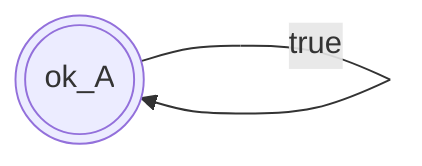
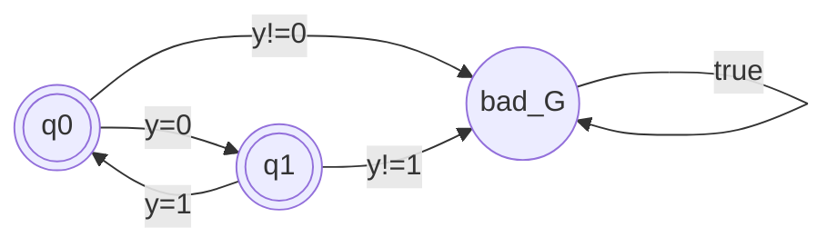
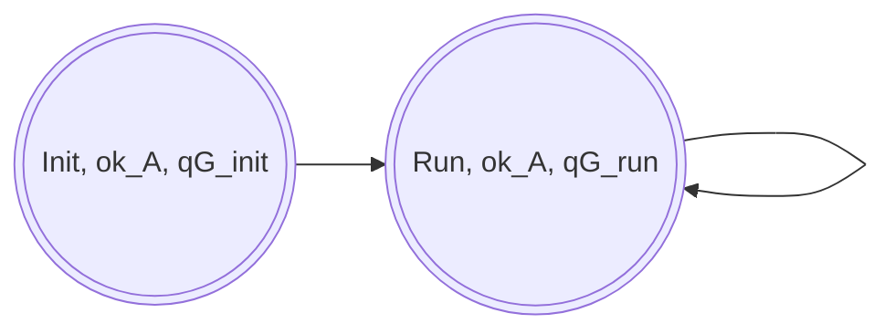
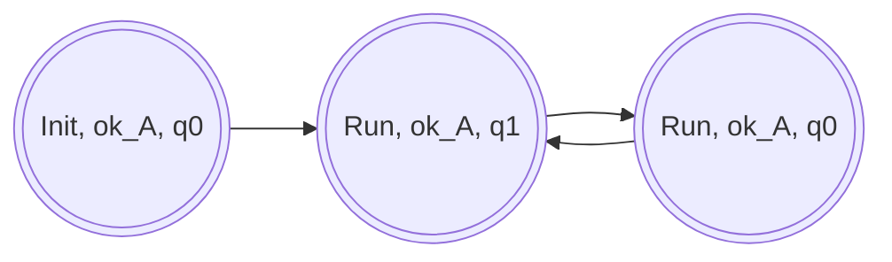

# Formalization (Pure Automata Version)

## 1. Scope and Goal

Scope:

- synchronous Kairos programs modeled in abstract relational form,
- temporal contracts in the safety LTL fragment,
- translation of LTL contracts into local first-order obligations over finite histories, proved with standard deductive verification techniques.

Goal:

Given a node \(N\) (program semantics) and a specification \(\Phi=(A,G)\), generate and prove local first-order obligations over finite histories such that:

\[
\forall u,\;
u \models A
\implies
run(N,u) \models G.
\]

where \(u\) is an input stream (values read at each logical tick), and \(run(N,u)\) is the observable trace produced by \(N\) on \(u\). In short, every admissible input stream (satisfying `A`) induces only observable behaviors satisfying `G`.

## 2. Logic and Contracts

### 2.1 Streams and Interpretation Domains

Let \(I\) be the set of input variables and \(O\) the set of output variables.

For any variable set \(V\), let \(\mathrm{Val}(V)\) be the set of valuations of \(V\), and \(\mathrm{Str}(V)=\mathrm{Val}(V)^\omega\) the set of infinite streams of valuations.

No finiteness assumption is made on value domains: \(\mathrm{Val}(V)\) may be infinite (for example with integer-valued variables).

We use input streams \(u \in \mathrm{Str}(I)\) and observable streams \(w \in \mathrm{Str}(I \cup O)\) as semantic domains.

Assumptions constrain input behavior, so they are interpreted on \(\mathrm{Str}(I)\); guarantees constrain observable behavior, so they are interpreted on \(\mathrm{Str}(I \cup O)\). For a node \(N\), Section 3 will define how each input stream \(u\) induces one observable stream \(run(N,u)\in\mathrm{Str}(I\cup O)\).

We write \(\mathrm{Hist}(V)\) for the set of finite backward histories over \(V\), and \(\mathrm{HFO}(V)\) for first-order predicates over \(\mathrm{Hist}(V)\). At time \(i\), \(h_i^V\in\mathrm{Hist}(V)\) denotes the current finite history prefix used to interpret state predicates. Hence \(A\) is an LTL formula whose state propositions are in \(\mathrm{HFO}(I)\), and \(G\) is an LTL formula whose state propositions are in \(\mathrm{HFO}(I\cup O)\).

### 2.2 Formula Fragment and Satisfaction

We use formulas built from temporal operators `X` (next) and `W` (weak until), with standard Boolean connectives (\(\land,\lor,\neg\)); \(\Rightarrow\) and \(\Leftrightarrow\) are abbreviations.

In this document, contract formulas \(A\) and \(G\) are assumed to satisfy the safety-oriented positivity condition: `W` occurs only positively (never under negation). This condition is checked syntactically and is used later to build deterministic safety automata.

Grammar:
\[
\varphi ::= p \mid \neg\varphi \mid \varphi \land \varphi \mid \varphi \lor \varphi \mid X\varphi \mid \varphi \,W\, \varphi,
\qquad p\in\mathrm{HFO}(V).
\]

We also use the standard global operator \(\mathbf{G}\) as an abbreviation:
\[
\mathbf{G}\varphi \;\equiv\; \varphi\,W\,false.
\]

Satisfaction for \(\pi\in\mathrm{Str}(V)\), \(i\in\mathbb N\):
\[
\begin{array}{l}
\pi,i \models p \iff p(h_i^V) \text{ where } h_i^V \in \mathrm{Hist}(V) \text{ is the finite history at time } i\\
\pi,i \models \neg\varphi \iff \neg(\pi,i\models\varphi)\\
\pi,i \models \varphi\land\psi \iff (\pi,i\models\varphi)\land(\pi,i\models\psi)\\
\pi,i \models \varphi\lor\psi \iff (\pi,i\models\varphi)\lor(\pi,i\models\psi)\\
\pi,i \models X\varphi \iff \pi,i+1\models\varphi\\
\pi,i \models \varphi W \psi \iff
\Bigl(\forall j\ge i,\ \pi,j\models\varphi\Bigr)\ \lor
\Bigl(\exists k\ge i,\ \pi,k\models\psi\ \land\ \forall j\in[i,k),\ \pi,j\models\varphi\Bigr)\\
\pi,i \models \mathbf{G}\varphi \iff \forall j\ge i,\ \pi,j\models\varphi\\
\quad\text{and}\quad
\pi\models\varphi \iff \pi,0\models\varphi
\end{array}
\]

### 2.3 Safety Property Assumption

From the positivity condition above (with Boolean abbreviations expanded), contracts are taken in the safety fragment:
\[
A \in \mathrm{LTL}_{safe}(\mathrm{HFO}(I)),
\qquad
G \in \mathrm{LTL}_{safe}(\mathrm{HFO}(I\cup O)).
\]

Formally, \(\varphi\) is safety iff:
\[
\forall \pi \in \mathrm{Str}(V),\;
\pi \not\models \varphi
\Rightarrow
\exists n\in\mathbb N,\;
\forall \pi' \in \mathrm{Str}(V),\;
\pi[0..n]\cdot \pi' \not\models \varphi.
\]

Intuition: every violation has a finite bad prefix.

The automata-level view used by the method is introduced in Section 5.

## 3. Abstract Kairos Model

This abstraction follows the synchronous reactive tradition and is close to a symbolic Mealy/Lustre-style model.

Kairos is viewed as a synchronous transition language: at each logical tick, a node reads inputs, evaluates control conditions (`when`), and produces outputs and next-state values through guarded updates.

The objective is a relational, proof-oriented semantics of Kairos programs so temporal contracts can be reduced to local first-order proof obligations over transitions.

We separate the program from its specification. This abstract model is used to simplify the presentation; the tool does not explicitly translate programs into this model as a standalone intermediate artifact.

### 3.1 Syntax

#### 3.1.1 Node and Specification

A node is represented as \(N=(\mathcal S,s_0,\mathcal T,X,I,O)\), where \(\mathcal S\) is the finite control-state set, \(s_0\in\mathcal S\) is the initial control state, \(X\) is the variable set, and \(I,O\subseteq X\) are the input and output variables with \(I\cap O=\varnothing\). Internal variables are \(L=X\setminus(I\cup O)\), so \(X=I\uplus O\uplus L\).

We write transitions with the arrow notation \(s \xrightarrow{\gamma/\rho} s'\), equivalently \((s,\gamma,\rho,s')\in\mathcal T\).

Let \(\Sigma=\mathrm{Val}(X)\) be the valuation domain over program variables. We use \(\Gamma=(\Sigma\to\mathbb B)\) for guards and \(R=(\Sigma\times\Sigma\to\mathbb B)\) for update relations, so \(\mathcal T\subseteq\mathcal S\times\Gamma\times R\times\mathcal S\). Intuitively, \(\gamma\) constrains the current step context and \(\rho\) constrains the pair (current valuation, next valuation). Guards are interpreted on the current finite history \(h_i^X\).

Update relations are intentionally open-world in this abstraction: if a next-state variable is not constrained by \(\rho\), it remains unconstrained.

Initialization convention: before the first logical step, internal and output variables may be undefined. Here, "undefined" means "has no value yet", not "can take an arbitrary value". The `Init` control phase is used to establish defined values before regular-state reads.

The specification associated with a node is \(\Phi=(A,G,Inv)\), where `A` is a temporal assumption on input traces, `G` is a temporal guarantee on observable traces, and \(Inv:\mathcal S\to\mathrm{HFO}(X)\) maps each control state to a first-order state invariant over finite histories.

Types of `A` and `G` are those introduced in Section 2. Correctness is established for the pair \((N,\Phi)\).

#### 3.1.2 Well-Formedness (Deterministic Profile)

We target deterministic, non-blocking programs. Since the transition model is relational, this is not automatic: from one configuration \((s,\sigma)\), several control branches may be enabled, or one branch may admit several next valuations. We therefore impose two high-level constraints.

In this document, these constraints are assumptions of the model and are considered true by construction of well-formed Kairos programs.

`Det-Step` (total functional step):
\[
\forall s\in\mathcal S,\forall \sigma\in\Sigma,\exists!\,s'\in\mathcal S,\exists!\,\sigma'\in\Sigma,\;
(s,\sigma)\to(s',\sigma').
\]

`Input-Frame` (inputs are read-only across one step):
\[
\forall (s,\sigma)\to(s',\sigma'),\;
\sigma\!\upharpoonright_I=\sigma'\!\upharpoonright_I.
\]

#### 3.1.3 Abstract Examples

For readability, we present only the node part in these examples and omit the associated specification \(\Phi\) at this stage.

`delay_int` (one-tick integer delay):
\[
\begin{array}{l}
N_{delay}=(\{Init,Run\},Init,\mathcal T_{delay},X,\{x\},\{y\})\quad\text{with}\quad X=\{x,y,z\}\\
\mathcal T_{delay}=\{Init\xrightarrow{true\,/\,z'=x}Run,\;Run\xrightarrow{true\,/\,y'=z\land z'=x}Run\}
\end{array}
\]

`toggle` (alternating output):
\[
\begin{array}{l}
N_{toggle}=(\{Init,Run\},Init,\mathcal T_{toggle},\{y\},\varnothing,\{y\})\\
\mathcal T_{toggle}=\{Init\xrightarrow{true\,/\,y'=0}Run,\;Run\xrightarrow{true\,/\,y'=1-y}Run\}
\end{array}
\]

## 4. Node Semantics

### 4.1 Step Semantics

The operational semantics of \(N\) is a transition relation on configurations \((s,\sigma)\), where \(s \in \mathcal S\) and \(\sigma \in \Sigma\). Intuitively, \((s,\sigma)\) moves to \((s',\sigma')\) when there is a control transition \((s,\gamma,\rho,s') \in \mathcal T\), \(\sigma\) satisfies \(\gamma\), and \((\sigma,\sigma')\) satisfies \(\rho\).

Formally:

\[
(s,\sigma) \to (s',\sigma')
\iff
\exists \gamma,\rho.\;
(s,\gamma,\rho,s')\in\mathcal T
\;\land\;
\sigma\models\gamma
\;\land\;
(\sigma,\sigma')\models\rho
\]

This step relation is intra-instant: it computes the end-of-tick valuation from the begin-of-tick valuation under the current input.

Under the `Det-Step` assumption from Section 3.1.2, this relation is total and functional. We therefore write:
\[
step_N:\mathcal S\times\Sigma\to\mathcal S\times\Sigma,\qquad
step_N(s,\sigma)=(s',\sigma')\iff (s,\sigma)\to(s',\sigma').
\]

### 4.2 Stream Semantics

An input stream is a sequence:

\[
u = u_0,u_1,u_2,\dots
\quad\text{with}\quad
u_i \in \{\sigma\!\upharpoonright_I \mid \sigma \in \Sigma\}.
\]

For a given input stream \(u\), an execution is a sequence of begin-of-tick configurations \((s_i,\sigma_i)_{i\ge 0}\) such that, for every \(i\), there exists an end-of-tick valuation \(\sigma_i^+ \in \Sigma\) satisfying:

\[
\begin{array}{l}
\text{Step}(i):\ (s_i,\sigma_i)\to(s_{i+1},\sigma_i^+)\\
\text{SampleIn}(i):\ \sigma_i\!\upharpoonright_I = u_i\\
\text{Carry}(i):\ \sigma_{i+1}\!\upharpoonright_{X\setminus I} = \sigma_i^+\!\upharpoonright_{X\setminus I}\\
\text{SampleIn}(i+1):\ \sigma_{i+1}\!\upharpoonright_I = u_{i+1}
\end{array}
\]

The two `SampleIn` clauses encode input sampling at each tick. `Carry` encodes state propagation: non-input variables at the next tick start come from the previous tick end.

The observable trace induced by \(u\) is \(run(N,u)=\tau_0,\tau_1,\tau_2,\dots\) over \(I\cup O\), where for every \(i\):
\[
\tau_i\!\upharpoonright_I=u_i
\qquad\text{and}\qquad
\tau_i\!\upharpoonright_O=\sigma_i^+\!\upharpoonright_O.
\]

Consistently with the initialization convention of Section 3, variables may be undefined before the first step. In examples, when an initial output is intentionally not constrained, we only comment the guaranteed part of the output stream.

Example (`delay_int`):

Using \(N_{delay}\) from Section 3.1.3 and input stream \(x_0=3,\ x_1=5,\ x_2=2,\dots\), one execution is:

\[
\begin{array}{l}
(Init,\sigma_0)\to(Run,\sigma_0^+),\quad \sigma_0(x)=3,\ \sigma_0^+(z)=3\\
(Run,\sigma_1)\to(Run,\sigma_1^+),\quad \sigma_1(x)=5,\ \sigma_1(z)=3,\ \sigma_1^+(y)=3,\ \sigma_1^+(z)=5\\
(Run,\sigma_2)\to(Run,\sigma_2^+),\quad \sigma_2(x)=2,\ \sigma_2(z)=5,\ \sigma_2^+(y)=5,\ \sigma_2^+(z)=2
\end{array}
\]

Hence:
\[
y_1 = x_0,\quad y_2 = x_1,\ \dots
\]
so \(y\) is one tick behind \(x\) (after initialization). The value \(y_0\) is not constrained by the `Init` transition in this abstract example.

Example (`toggle`):

Using \(N_{toggle}\) from Section 3.1.3, one execution (begin-of-tick valuations \(\sigma_i\), end-of-tick valuations \(\sigma_i^+\)) is:

\[
\begin{array}{l}
(Init,\sigma_0)\to(Run,\sigma_0^+),\quad \sigma_0^+(y)=0\\
(Run,\sigma_1)\to(Run,\sigma_1^+),\quad \sigma_1(y)=0,\ \sigma_1^+(y)=1\\
(Run,\sigma_2)\to(Run,\sigma_2^+),\quad \sigma_2(y)=1,\ \sigma_2^+(y)=0\\
(Run,\sigma_3)\to(Run,\sigma_3^+),\quad \sigma_3(y)=0,\ \sigma_3^+(y)=1
\end{array}
\]

so the observable output stream is \(0,1,0,1,\dots\).

Implementation correspondence: one logical tick in the implementation matches one application of `step_N`, plus input resampling and state carry as above. The resulting stream \(run(N,u)\) is exactly the semantic object consumed later by contract automata (Sections 5 to 7).

### 4.3 Correctness w.r.t. the Temporal Specification

Contract semantics is evaluated as follows: `A` is interpreted on the input stream \(u\), and `G` is interpreted on the observable stream \(run(N,u)\).

With \(\Phi=(A,G,Inv)\), we say that \(N\) is temporally correct w.r.t. \(\Phi\) iff:

\[
\forall u,\;
u \models A
\implies
run(N,u) \models G.
\]

Intuitively: every admissible input stream (satisfying `A`) induces only observable behaviors that satisfy `G`.

## 5. From Temporal Contracts to Safety Automata

### 5.1 Symbolic Safety Automata

Each safety formula \(\varphi\) over \(\mathrm{HFO}(V)\) can be compiled into a deterministic symbolic safety automaton \(\mathcal S_\varphi=(Q,q_0,\delta,bad)\), where:
- \(Q\) is finite,
- \(q_0\in Q\) is initial,
- \(\delta: Q \times \mathrm{Hist}(V) \to Q\) is a total deterministic transition function,
- \(bad\in Q\) is an absorbing bad state.

Equivalently, for all \(q\in Q\) and \(h\in\mathrm{Hist}(V)\), there exists exactly one \(q'\in Q\) such that \(\delta(q,h)=q'\).

For readability, we also use symbolic edge notation \(q \xrightarrow{\alpha} q'\), where \(\alpha\in\mathrm{HFO}(V)\) characterizes the histories \(h\) such that \(\delta(q,h)=q'\).

Given \(\pi\in\mathrm{Str}(V)\), we define its (unique) state sequence \(r^\pi:\mathbb N\to Q\) by:
\[
r^\pi(0)=q_0,\qquad r^\pi(i+1)=\delta(r^\pi(i),h_i^V).
\]
The trace \(\pi\) is accepted iff \(\forall i\in\mathbb N,\ r^\pi(i)\neq bad\).

Correctness of this automaton construction is the language equivalence:
\[
L(\varphi)=L(\mathcal S_\varphi)
=\{\pi\in\mathrm{Str}(V) \mid \pi \models \varphi\}.
\]

### 5.2 Contract Automata for \(A\) and \(G\)

Given \(\Phi=(A,G,Inv)\), we assume:

- `A` is compiled into a safety automaton \(\mathcal A=(Q_A,q^A_0,\Delta_A,bad_A)\),
- `G` is compiled into a safety automaton \(\mathcal G=(Q_G,q^G_0,\Delta_G,bad_G)\).

The mapping \(Inv\) is used later to help the deductive proof method by strengthening local proof contexts.

Assumptions on these automata:

- each symbolic edge guard is interpreted as a first-order predicate over finite histories;
- automata are deterministic and complete (equivalently, they denote total transition functions on finite histories);
- \(bad_A\) and \(bad_G\) are absorbing.

Standard correctness assumptions:

- automaton executions exactly follow the compiled LTL semantics,
- `bad_A` means violation of `A`,
- `bad_G` means violation of `G`.

These are exactly the artifacts consumed by the logical-product phase in Section 6.

### 5.3 Example (toggle)

For `toggle`, an obvious choice is:

- assumption \(A=true\);
- guarantee \(G=(y=0)\land \mathbf{G}(y=0\Rightarrow X(y=1))\land \mathbf{G}(y=1\Rightarrow X(y=0))\).

The resulting safety automata for these formulas are shown below. For this \(A=true\) case, a complete view may include an explicit sink \(bad_A\), but it is unreachable and omitted here for readability.

## 6. Logical Product and Reachability

We work on product triples \((s,q_A,q_G)\in\mathcal S\times Q_A\times Q_G\), where \(s\) is the program control state, \(q_A\) is the residual assumption state, and \(q_G\) is the residual guarantee state.

Initialization is \((s_0,q^A_0,q^G_0)\).

Logical successor relation:
\[
(s,q_A,q_G)\leadsto (s',q'_A,q'_G)
\]
iff there exist a program transition \(s\xrightarrow{\gamma/\rho}s'\), an automaton edge \(q_A\xrightarrow{\alpha_A}q'_A\), and an automaton edge \(q_G\xrightarrow{\alpha_G}q'_G\), such that
\[
\mathrm{SAT}\bigl(\gamma\land \llbracket\alpha_A\rrbracket\land \llbracket\alpha_G\rrbracket\bigr).
\]

The product-compatibility check uses guards only. The update relation \(\rho\) is handled later when generating local obligations.

Reachability is the least fixpoint:
\[
Reach_0=\{(s_0,q^A_0,q^G_0)\},
\]
\[
Reach_{k+1}=Reach_k\cup
\left\{
x'\ \middle|\
x=(s,q_A,q_G)\in Reach_k,\ x\leadsto x'=(s',q'_A,q'_G),\ q_G\neq bad_G,\ q'_G\neq bad_G
\right\},
\]
\[
Reach=\bigcup_{k\in\mathbb N} Reach_k.
\]

So triples in \(bad_G\) are not propagated in \(Reach\). However, candidate moves from reached triples toward \(q'_G=bad_G\) are still enumerated later in Section 7 to generate `GenObl` formulas.

Implementation correspondence: this phase is a BFS over product triples, where each candidate successor is validated by one SAT check of guard compatibility.

### 6.1 Examples (toggle and delay products)

Example (`delay_int` product):

Using \(N_{delay}\) (Section 3.1.3), take the contract pair
\[
A=true,\qquad G=\mathbf{G}(X(y)=x)
\]
which captures one-tick delay from the second tick onward. A corresponding safety-automaton shape for \(G\) uses a tracking state after initialization and a bad sink.

At product level, one representative reachable prefix is:
\[
(Init,ok_A,q^G_{init})\leadsto(Run,ok_A,q^G_{run}),
\]
then in `Run`:
\[
(Run,ok_A,q^G_{run})\leadsto(Run,ok_A,q^G_{run})\leadsto\cdots
\]
as long as step guards remain compatible with the delay condition.

An abstract reachable-product sketch is:

Example (`toggle` product):

Using \(N_{toggle}\) (Section 3.1.3) and the automata of Section 5.3:
\[
(Init,ok_A,q_0)\leadsto(Run,ok_A,q_1)
\]
through \(Init\xrightarrow{true/y'=0}Run\), \(ok_A\xrightarrow{true}ok_A\), and \(q_0\xrightarrow{(y=0)}q_1\).

Then the `Run -> Run` transition \(Run\xrightarrow{true/y'=1-y}Run\) alternates the guarantee state:
\[
(Run,ok_A,q_1)\leadsto(Run,ok_A,q_0)\leadsto(Run,ok_A,q_1)\leadsto\cdots
\]

Automaton-style rendering of the reachable product:

No reachable triple contains \(bad_G\), which matches the expected correctness of `toggle`.

Why no `bad` state appears in these product views: Section 6 only shows the reachable safe product, i.e., triples kept in \(Reach\). By construction, triples with \(q_G=bad_G\) (and successors with \(q'_G=bad_G\)) are not propagated in this reachability set. Potential moves toward \(bad_G\) are still considered later in Section 7 to generate `GenObl` formulas.

## 7. Generating Local Obligations

### 7.1 Formal Definition (`GenHyp` then `GenObl`)

Let \(Reach \subseteq \mathcal S \times Q_A \times Q_G\) be the reached set.

For a fixed program transition \(t=(s,\gamma,\rho,s')\in\mathcal T\), we enumerate compatible combinations starting from reached source triples \((s,q_A,q_G)\in Reach\), with outgoing automaton edges from \(q_A\) and \(q_G\).

`Compat` (locally SAT-compatible combinations):

\[
\begin{aligned}
Compat_t=\{&(q_A,q_G,q'_A,q'_G,\alpha_A,\alpha_G)\mid\\
&(s,q_A,q_G)\in Reach,\\
&(q_A,\alpha_A,q'_A)\in\Delta_A,\ (q_G,\alpha_G,q'_G)\in\Delta_G,\\
&\mathrm{SAT}(\gamma\land\llbracket\alpha_A\rrbracket\land\llbracket\alpha_G\rrbracket)\}.
\end{aligned}
\]

The SAT filter is guard-only: \(\gamma\land\llbracket\alpha_A\rrbracket\land\llbracket\alpha_G\rrbracket\), interpreted on the current finite history. The update relation \(\rho\) is used later in the deductive obligations attached to \(t\), not in this compatibility test.

For readability, for any \(c=(q_A,q_G,q'_A,q'_G,\alpha_A,\alpha_G)\in Compat_t\), define:
\[
\psi_t(c)=\gamma\land\llbracket\alpha_A\rrbracket\land\llbracket\alpha_G\rrbracket,
\]
\[
safe(c)\iff (q'_A\neq bad_A \land q'_G\neq bad_G),\qquad
badG(c)\iff (q'_A\neq bad_A \land q'_G=bad_G).
\]

`GenHyp` (disjunction of safe incoming contexts for \(t\)): keep combinations in \(Compat_t\) whose successors stay outside \(bad_A\) and \(bad_G\), then build:

\[
Hyp_t=
\bigvee
\left\{
\psi_t(c)
\mid
c\in Compat_t,\ safe(c)
\right\}.
\]

If the set is empty, no hypothesis is added. Otherwise \(Hyp_t\) is added to `requires(t)`.

`GenObl` (forbid bad-\(G\) successors under active assumptions): keep combinations in \(Compat_t\) with \(q'_G=bad_G\) and \(q'_A\neq bad_A\), then generate:

\[
Obl_t=
\left\{
\neg\psi_t(c)
\mid
c\in Compat_t,\ badG(c)
\right\}.
\]

All formulas in \(Obl_t\) are added to `ensures(t)`.

The condition \(q'_A\neq bad_A\) enforces assume/guarantee discipline: once assumptions are violated, no guarantee-preservation obligation is generated.

Generated annotations for \(t\):
\[
(requires(t),ensures(t))\;\supseteq\;(Hyp_t,Obl_t).
\]

Global phase:

\[
GenHypObl(N,\mathcal A,\mathcal G,Reach)=
\left(\{Hyp_t\}_t,\{Obl_t\}_t\right).
\]

Abstractly, Section 7 computes a transition annotation map:
\[
Ann_7:\mathcal T\to \mathcal P(\mathrm{HFO}(X))\times \mathcal P(\mathrm{HFO}(X)),
\]
with \(Ann_7(t)=(Req_t^{(7)},Ens_t^{(7)})\), where \(Req_t^{(7)}\) is inserted in `requires(t)` and \(Ens_t^{(7)}\) in `ensures(t)`.

### 7.2 Examples (delay and toggle)

Example (`delay_int`):

Using the delay product from Section 6.1, consider the two reached safe contexts:
\[
(Init,ok_A,q^G_{init}),\qquad (Run,ok_A,q^G_{run}).
\]

For `GenHyp`, the `Init -> Run` transition gets one compatible safe combination, yielding:
\[
Hyp_{init}\coloneqq \gamma_{init}\land true\land\llbracket\alpha_{init}\rrbracket,
\]
where \(\alpha_{init}\) is the guarantee-edge label from \(q^G_{init}\) to its safe successor.

For the loop transition `Run -> Run`, the compatible safe combination yields:
\[
Hyp_{delay}\coloneqq \gamma_{run}\land true\land\llbracket\alpha_{run}\rrbracket.
\]
Since \(\gamma_{run}=true\) in \(N_{delay}\), this simplifies to:
\[
Hyp_{delay}=\llbracket\alpha_{run}\rrbracket.
\]

For `GenObl`, bad-target combinations are those with \(q'_G=bad_G\) and \(q'_A\neq bad_A\); each one produces an `ensures` formula of the form:
\[
\neg\bigl(\gamma\land true\land\llbracket\alpha_{bad}\rrbracket\bigr).
\]
These obligations are attached to the corresponding transition and rule out locally compatible moves toward \(bad_G\).

Example (`toggle`):

For `toggle`, the reachable product in Section 6.1 has only safe alternating triples and no compatible bad-target combination.

Therefore:

\[
Obl_t=\varnothing
\]

for all transitions \(t\).

For `GenHyp`, the result is non-empty on the `Run -> Run` transition. Using the two reachable product contexts \((Run,ok_A,q_0)\) and \((Run,ok_A,q_1)\), the compatible safe combinations induce:

\[
HypLoop \coloneqq (\gamma\land true\land(y=0)) \lor (\gamma\land true\land(y=1)).
\]

Since \(\gamma=true\) on `Run -> Run` for `toggle`, this simplifies to:

\[
HypLoop=(y=0)\lor(y=1),
\]

which is added to `requires(Run -> Run)`. This context fact is simplifiable, but it is intentionally kept in generated annotations for debugging and traceability.

## 8. User-Provided State Invariants (`Inv`)

User invariants are proof annotations attached to control states through
\[
Inv:\mathcal S\to \mathrm{HFO}(X).
\]

In the implementation, `Inv` is built and injected by a dedicated coherency pass.

Construction of \(Inv(s)\):

1. collect declared state invariants already attached to state \(s\),
2. collect user `ensures` formulas targeting state \(s\),
3. build \(Inv(s)\) as their conjunction (after deduplication).

Insertion on transitions \(t:s\to s'\):

\[
requires(t)\;\leftarrow\;requires(t)\cup\{Inv(s)\},
\]
\[
ensures(t)\;\leftarrow\;ensures(t)\cup\{Shift(Inv(s'))\}.
\]

An initialization coherency goal is also added at `init_state`:
\[
Shift(Inv(s_0)).
\]

`Shift` is defined abstractly by semantic correctness: for any
\(\phi\in\mathrm{HFO}(X)\) and any finite history \(h\in\mathrm{Hist}(X)\),
\[
h \models Shift(\phi)\iff next(h)\models \phi,
\]
where \(next(h)\) is the one-step extended history.

This insertion is purely proof-oriented: it does not modify the operational step semantics. In pure-automate mode, these state-relation invariants are then reused to strengthen local transition contexts during obligation generation.

Combined with Section 7, this yields the final per-transition proof annotation:
\[
Ann:\mathcal T\to \mathcal P(\mathrm{HFO}(X))\times \mathcal P(\mathrm{HFO}(X)),
\]
where for each \(t\), \(Ann(t)=(Req_t,Ens_t)\) is the pair of formula sets ultimately attached to `requires(t)` and `ensures(t)`.

## 9. Transition-Local Deductive Verification

At this stage, each transition \(t\in\mathcal T\) carries two sets of formulas:
\[
Req_t\subseteq \mathrm{HFO}(X),\qquad Ens_t\subseteq \mathrm{HFO}(X),
\]
coming from Sections 7 and 8 (plus user contracts when present).

In the implementation, verification conditions are generated as guarded local implications. For a transition \(t=(s,\gamma,\rho,s')\), define its activation condition:
\[
Active_t \;\coloneqq\; (state=s)\land \gamma.
\]

The generated obligations are abstractly:
\[
\mathrm{Req\text{-}VC}(t):\quad Active_t \Rightarrow \bigwedge Req_t,
\]
\[
\mathrm{Ens\text{-}VC}(t):\quad Active_t \land \rho \land \bigwedge Req_t \Rightarrow \bigwedge Ens_t.
\]

`Req-VC` comes from transition `requires`: if \(t\) is active, its `requires` must hold.  
`Ens-VC` comes from transition `ensures`: for an active \(t\), under \(\rho\) and established `requires`, the `ensures` must hold.

So guards are not a separate side condition: they are part of the activation predicate that gates transition-local obligations.

Equivalent relational/inclusion view (Hoare-style with a relational transition):

For \(t=(s,\gamma,\rho,s')\), define:
\[
Pre_t(h)\coloneqq Active_t(h)\land \bigwedge Req_t(h),
\]
\[
Post_t(h')\coloneqq \bigwedge Ens_t(h'),
\]
\[
Rel_t(h,h')\coloneqq \rho(h,h').
\]

Then `Ens-VC` is equivalently:
\[
\forall h,h'.\; Pre_t(h)\land Rel_t(h,h')\Rightarrow Post_t(h'),
\]
or, as a set inclusion:
\[
Rel_t[\{h\mid Pre_t(h)\}] \subseteq \{h'\mid Post_t(h')\}.
\]

This is the relational counterpart of weakest-precondition reasoning: no imperative code block is needed, because the middle of the Hoare triple is the transition relation itself.

This is Hoare-style in spirit, but operationally it is encoded as a family of guarded implications that are composed in the global VC.

## 10. Soundness Theorem (with Key Lemmas)

### 10.1 Lemma 1 (Local generation exactness)

Every local combination
\((t,q_A,q_G,q'_A,q'_G,\alpha_A,\alpha_G)\) leading to `bad_G` under \(q'_A \neq bad_A\)
(and encountered during reached-triple enumeration) produces an obligation that exactly negates its guard conjunction.

### 10.2 Lemma 2 (Local safety)

If all local obligations of a transition `t` are valid, then no concrete step executing `t` can realize a local combination leading to `bad_G` under \(q'_A \neq bad_A\).

Proof: immediate by contradiction, each forbidden combination is the negation of one precise conjunction.

### 10.3 Lemma 3 (Preservation outside `bad_G`)

Assume all obligations are valid. For any concrete step in the trace and any associated coherent logical triple, if we are outside `bad_G` before the step and outside `bad_A` after the step, then we remain outside `bad_G` after the step.

Proof: apply Lemma 2 to the current step.

### 10.4 Main Theorem

#### Statement

Under the assumptions:

1. correctness of LTL-to-automata compilation (`A`, `G`),
2. correctness of guard interpretation as first-order predicates over finite histories,
3. WP/backend correctness (all proved obligations are valid),
4. adequacy of local enumeration (all relevant combinations are covered),

then:

\[
\forall \rho,\; \rho\!\upharpoonright_{I} \models A
\implies
\rho\!\upharpoonright_{I\cup O} \models G.
\]

#### Proof (outline)

- Let \(\rho\) be an execution such that \(\rho\!\upharpoonright_{I} \models A\).
- By correctness of \(\mathcal A\), the `A` automaton never visits `bad_A`.
- Assume for contradiction that \(\rho\!\upharpoonright_{I\cup O} \not\models G\).
- Then, by correctness of \(\mathcal G\), there exists a first index where the `G` state reaches `bad_G`.
- On the corresponding step, we have a local combination \((t,\alpha_A,\alpha_G)\) that leads to `bad_G` while staying outside `bad_A`.
- This combination is covered by generation (Assumption 4), so its local obligation exists (Lemma 1), and is valid (Assumption 3), hence impossible (Lemma 2).
- Contradiction.

Therefore \(\rho\!\upharpoonright_{I\cup O} \models G\).

## 11. Implementation Mapping and Pass Order

From the implementation perspective, the pipeline is:

1. parse/normalize source contracts and abstract node structure,
2. compute safety automata for `A` and `G`,
3. build and explore the logical product over \((s,q_A,q_G)\),
4. run `GenHyp` to add incoming-context formulas to transition `requires`,
5. run `GenObl` to add bad-target forbiddance formulas to transition `ensures`,
6. discharge generated obligations with standard WP/SAT backends.

Operational details:

- obligations are generated as local first-order formulas over finite histories,
- compatibility checks use SAT on guard conjunctions,
- the concrete implementation of `Shift` is realized with history operators (`now`/`pre_k`) and checked against the abstract criterion given in Section 8,
- generated formulas are simplified before insertion (including trivial ones, kept for diagnostics),
- the concrete generated artifact is an annotated OBC+ node where each transition carries the computed `requires`/`ensures` pair,
- verification is performed in pure-automate mode.

## 12. Examples End-to-End

The two running examples cover the full chain:

1. `delay_int`: abstract syntax (Section 3.1.3) and stream semantics (Section 4.2) show one-tick delay behavior.
2. `toggle`: contract automata (Section 5.3), reachable logical product (Section 6.1), and local obligation generation (Section 7.2) illustrate the end-to-end method.

In both examples, the generated local formulas match the expected temporal intent after simplification.

## 13. Limits and Assumptions

This formalization relies on:

- deterministic program profile (`Det-Step`, `Input-Frame`),
- contracts in the safety-oriented fragment (positivity condition on `W`),
- correctness of contract-to-automata construction,
- adequacy of product reachability/enumeration for relevant combinations,
- soundness of SAT/WP backends used to discharge obligations.

A practical caution is that systematically trivial generated formulas (for example \(\neg(true\land true\land true)\)) often indicate a construction issue, typically around bad-state propagation.
